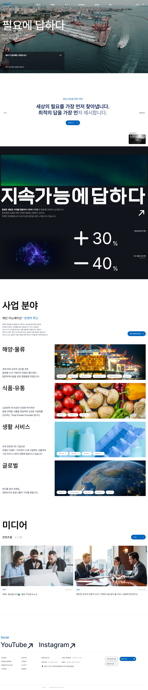
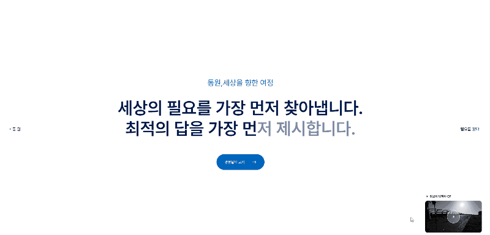
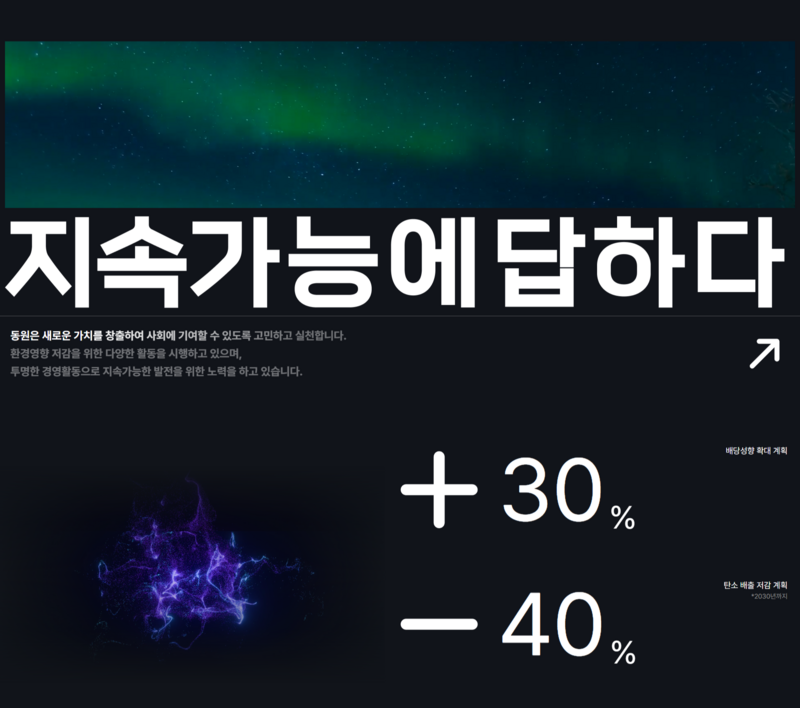
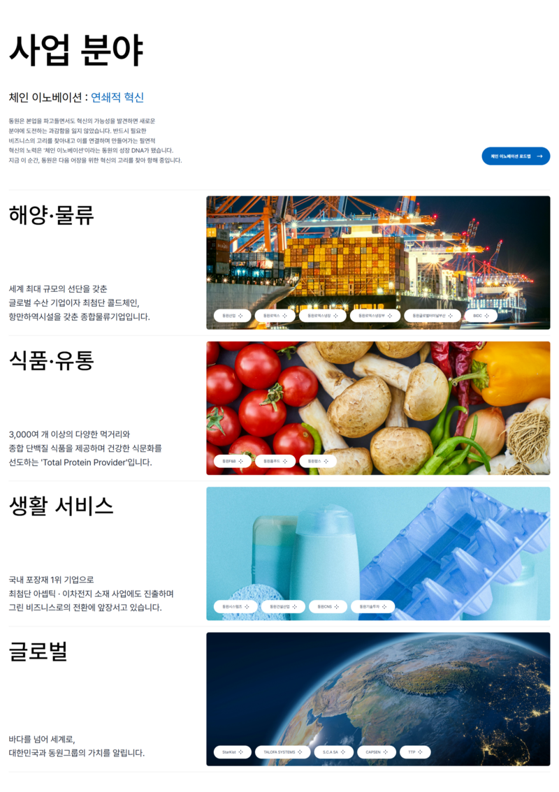
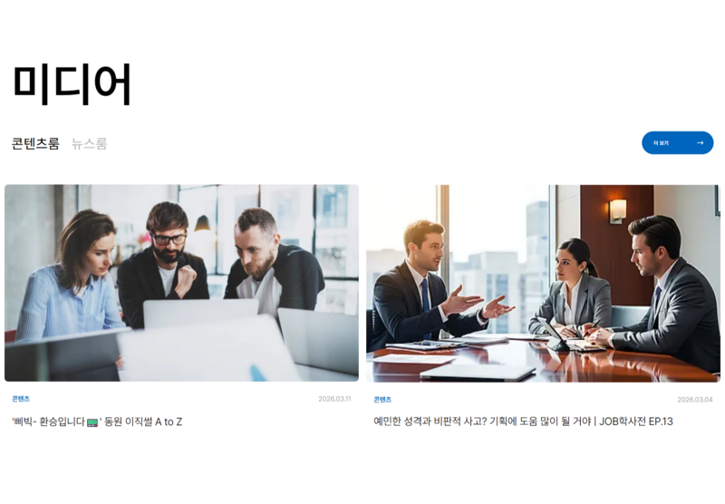

# 동원그룹 홈페이지 클론 코딩

동원그룹 메인 홈페이지를 React 기반으로 클론 코딩한 프로젝트입니다.  
섹션 단위 컴포넌트 분리, 반응형 레이아웃, 스크롤 애니메이션, 비디오 인터랙션, Three.js 기반 마우스 왜곡 효과 구현에 중점을 두고 작업했습니다.

## 배포 주소

https://ljj5928.github.io/CloneDongwon/

## 📌 프로젝트 소개

기존 동원그룹 홈페이지의 전체적인 레이아웃과 인터랙션을 참고해 제작한 클론 코딩 프로젝트입니다.  
단순한 정적 마크업 복제가 아니라, 실제 사용자 경험에 가까운 움직임과 전환 효과를 구현하는 데 집중했습니다.

특히 다음 요소를 중심으로 작업했습니다.

- 헤더 스크롤 반응 및 라이트 모드 전환
- 데스크톱 / 모바일 메뉴 구조 분리
- Hero 섹션 비디오 슬라이드와 마우스 왜곡 인터랙션
- GSAP ScrollTrigger를 활용한 스크롤 기반 애니메이션
- 반응형 레이아웃 구성
- 데이터 매핑 기반 섹션 렌더링

## 🎯 프로젝트 목표

- 컴포넌트 단위로 구조를 분리해 유지보수가 쉬운 화면 구성 만들기
- 단순 퍼블리싱을 넘어 인터랙션이 포함된 메인 페이지 구현하기
- Three.js와 GSAP 같은 라이브러리를 실제 UI에 연결해보기
- 반응형 대응을 통해 다양한 디바이스 환경에서도 자연스럽게 동작하도록 만들기

## 🖼 Preview

### Main Page
메인 페이지는 **Hero / Journey / Answer / Business / Media** 섹션으로 구성되어 있으며,  
원본 사이트의 흐름을 참고해 메인 비주얼 중심의 인터랙션형 랜딩 페이지로 구현했습니다.

<!-- 메인 전체 화면 이미지 -->


---

### Header
스크롤 방향과 배경 섹션에 따라 스타일이 변하는 반응형 헤더입니다.

- 스크롤 다운 시 헤더 숨김
- 특정 구간에서 화이트 모드 전환
- 데스크톱 / 모바일 메뉴 구조 분리
- 검색 UI 및 언어 선택 UI 구현

<!-- 헤더 이미지 -->


---

### Hero
비디오 슬라이드와 마우스 인터랙션을 중심으로 구성한 메인 비주얼 섹션입니다.

- 비디오 자동 전환
- SVG 마스크 오버레이 적용
- Three.js 기반 마우스 왜곡 효과 구현
- 사용자 움직임에 반응하는 인터랙션 구성

<!-- 히어로 이미지 또는 gif -->


---

### Journey
사용자 액션에 따라 홍보 영상이 재생되는 인터랙션 섹션입니다.

- 클릭 시 영상 재생
- 모바일 / 데스크톱 재생 방식 분리
- 재생 상태에 따른 UI 변경

<!-- 저니 이미지 -->


---

### Answer
스크롤 흐름에 따라 텍스트와 수치가 순차적으로 등장하는 애니메이션 섹션입니다.

- GSAP ScrollTrigger 기반 등장 애니메이션
- 텍스트 강조 효과
- 숫자 카운팅 애니메이션 구현

<!-- Answer 이미지 -->


---

### Business / Media
데이터 기반 렌더링과 탭 전환 UI를 중심으로 구성한 콘텐츠 섹션입니다.

- 배열 데이터 기반 카드 렌더링
- 탭 전환 기능 구현
- 반복 UI 구조 재사용

<!-- 비즈니스 / 미디어 이미지 -->



## ✨ 주요 기능

### 1. 반응형 Header

- `scrollY` 값을 기준으로 헤더 숨김 처리
- 밝은 배경 섹션에 진입하면 헤더 색상 자동 전환
- 언어 선택 UI 구현
- 검색 메뉴 오픈 / 클로즈 상태 제어
- 모바일 햄버거 메뉴 및 아코디언 메뉴 구현

### 2. Hero 비디오 인터랙션

- 3개의 비디오를 자동 전환
- `Three.js`의 `ShaderMaterial`과 `VideoTexture`를 사용해 실시간 비디오 렌더링
- 마우스 이동 방향과 속도에 따라 왜곡 강도와 범위가 달라지도록 구현
- SVG 마스크를 사용해 메인 비주얼 오버레이 구성

### 3. Journey 영상 재생 기능

- 버튼 클릭 시 영상 재생
- 모바일에서는 같은 버튼으로 재생 / 정지 토글
- 데스크톱에서는 재생 상태에 따라 별도 닫기 버튼 제공

### 4. Answer 스크롤 애니메이션

- 섹션 진입 시 타이틀, 텍스트, 링크 순차 등장
- 텍스트를 글자 단위로 분리해 스크롤에 따라 점진적으로 강조
- 수치 데이터 카운팅 애니메이션 적용

### 5. Business 섹션 구성

- 사업 분야 데이터를 배열로 관리
- 반복 렌더링으로 카드 UI 구성
- 태그 및 이미지 영역 분리

### 6. Media 탭 전환

- 콘텐츠룸 / 뉴스룸 탭 전환 기능 구현
- 상태값에 따라 다른 데이터 필터링
- 이미지 오버레이 인터랙션 추가

### 7. Footer 정보 구성

- 정책 / 회사 정보 / 사이트 링크 분리
- 함수 기반 네비게이션 데이터 호출
- 소셜 링크 및 주소 영역 구성

## 🧩 구현 포인트

### 컴포넌트 중심 구조

페이지를 하나의 큰 파일로 작성하지 않고, `header`, `footer`, `home/sections` 기준으로 나누어 구조화했습니다.  
덕분에 각 섹션을 독립적으로 관리할 수 있고, 수정 시 영향 범위를 줄일 수 있었습니다.

### 상태 기반 UI 제어

메뉴 열림 여부, 언어 선택, 검색창 오픈, 모바일 메뉴 그룹 확장, 탭 전환, 영상 재생 여부 등을 모두 `useState`로 관리했습니다.  
단순한 화면 구현이 아니라, 실제 사용자의 상호작용 흐름에 맞춰 상태를 설계하는 데 집중했습니다.

### Three.js를 활용한 비디오 왜곡 효과

Hero 영역은 일반적인 배경 비디오가 아니라, `VideoTexture`를 셰이더에 연결해 마우스 움직임에 반응하는 왜곡 효과를 구현했습니다.  
이 과정에서 비디오 전환, 해상도 대응, 마우스 좌표 보정, 속도 기반 강도 조절 등을 함께 처리했습니다.

### GSAP ScrollTrigger 활용

Answer 섹션에서는 단순 fade 효과가 아니라, 텍스트 및 수치 애니메이션을 스크롤 시점에 맞춰 세밀하게 분리해 구성했습니다.  
등장 타이밍과 사용자 스크롤 흐름을 자연스럽게 연결하는 데 초점을 맞췄습니다.

### 데이터 매핑 방식 활용

Business, Media처럼 반복되는 UI는 하드코딩하지 않고 배열 데이터를 `map()`으로 렌더링했습니다.  
구조를 재사용 가능하게 만들고, 데이터 수정만으로 UI를 바꿀 수 있도록 구성했습니다.

## 기술 스택

### Frontend

- React
- JavaScript
- Vite

### Animation / Interaction

- GSAP
- ScrollTrigger
- Three.js

### UI / Styling

- CSS3
- Font Awesome
- Responsive Web

## 📁 프로젝트 구조

```bash
src/
├─ assets/
│  └─ dongwon/
│     ├─ Components/
│     │  ├─ footer/
│     │  │  └─ Footer.jsx
│     │  └─ header/
│     │     └─ Header.jsx
│     └─ Pages/
│        └─ home/
│           ├─ sections/
│           │  ├─ answer/
│           │  │  └─ Answer.jsx
│           │  ├─ business/
│           │  │  └─ Business.jsx
│           │  ├─ hero/
│           │  │  └─ Hero.jsx
│           │  ├─ journey/
│           │  │  └─ Journey.jsx
│           │  └─ media/
│           │     └─ Media.jsx
│           └─ Home.jsx
├─ App.jsx
├─ global.css
└─ main.jsx
```

## ⚠️ 안내 사항

본 프로젝트는 학습 및 포트폴리오 용도로 제작한 클론 코딩 프로젝트입니다.  
상업적 목적은 없으며, 실제 서비스와는 무관한 개인 작업물입니다.

원본 홈페이지의 레이아웃과 인터랙션을 참고해 구현했으며,  
공개 포트폴리오에 적합하도록 로고를 제외한 일부 이미지와 영상은  
무료 라이선스 기반의 대체 리소스로 재구성했습니다.

디자인 및 콘텐츠의 저작권은
https://www.dongwon.com/kr에 귀속됩니다.

## 📞 Contact
GitHub: https://github.com/ljj5928
Email: dlwowls10@naver.com